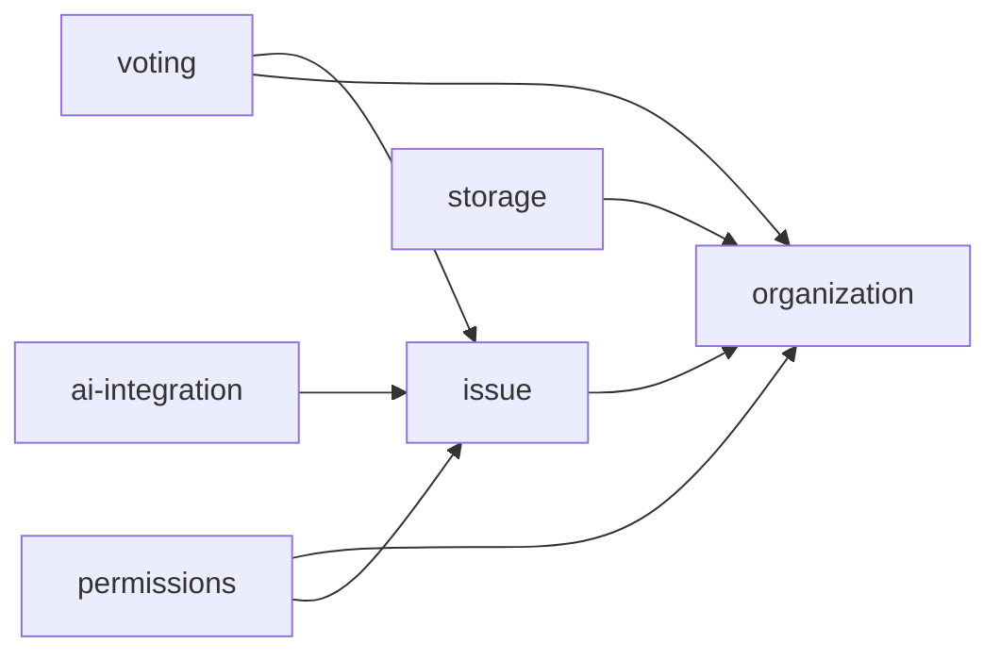

# IssueNumber.one Features

Top-level features of IssueNumber.one — a communication tool that helps teams identify and address their top priority issues through a continuous focused feedback and improvements process.

## Index

| Feature | Status | Description |
|---------|--------|-------------|
| [issue](issue/README.md) | Conceptual | The atomic unit — what an issue is, who can raise it, its lifecycle, anonymity, visibility, and moderation |
| [voting](voting/README.md) | Conceptual | Vote economics, per-team budgets, up/down rating, and sort orders |
| [organization](organization/README.md) | Conceptual | Org/team/sub-team hierarchy, peers, and public topics |
| [permissions](permissions/README.md) | Conceptual | Who can do what — the access matrix across teams, orgs, topics, and issues |
| [storage](storage/README.md) | Conceptual | Where org data lives — IssueNumber.one cloud or a GitHub repository via inGitDB |
| [ai-integration](ai-integration/README.md) | Conceptual | Optional AI-powered executive summaries of current issues |

## Feature Summaries

### issue

The core entity. An issue is a raised priority item with an author (or anonymous origin), status, assignee, deadline, and progress. By default every team member has exactly one active issue; teams may allow up to three. Issues have a clear lifecycle (raised → withdrawn/resolved/archived/banned), configurable anonymity, multi-level visibility, and defined moderation rules.

### voting

Votes are scarce by design. Each team member has a small per-team vote budget that forces prioritization of what actually matters today. Users cannot vote on their own issues, votes are refunded when an issue closes, and supporters can be notified on withdrawal. Ratings use upvotes and (optionally) downvotes, with configurable public/anonymous display.

### organization

Everything in IssueNumber.one is scoped to a team. An organization is simply a root-level team. Teams may have sub-teams, peer teams, and peer colleagues; members may specify their own peers. Public topics live outside the org hierarchy and may nest into sub-topics.

### permissions

Defines who can raise, see, archive, and create across teams, orgs, topics, and issues. Example rules: only team mates can raise a team issue; anyone in an org can see all teams' org-level issues; anyone on a team can archive any team issue.

### storage

Teams and orgs choose where their data lives: the IssueNumber.one cloud (default, Firestore-backed) or a GitHub repository (public or private) via [inGitDB](https://inGitDB.com). Public topics are always stored in a public GitHub repository proxied by an API layer.

### ai-integration

An optional feature a team/org can enable to have AI analyze current issues and provide an executive summary. Includes both a free-prompt mode and a hosted SaaS offering optimized for easy setup, privacy (including anonymity preservation), and zero maintenance.

## Feature Dependency Graph

## Outstanding Questions

- Should `assignee` and `deadline` (surfaced on the landing page) be part of `issue` core or a separate `issue/assignment` sub-feature?
- Should progress tracking (the progress bar surfaced on the landing page) be its own sub-feature of `issue`?
- Does `permissions` belong at the top level or nested under `organization`?
