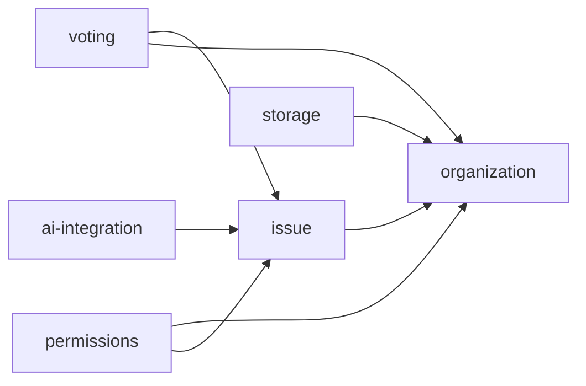

# IssueNumber.one Features

Top-level features of IssueNumber.one — a communication tool that helps teams identify and address their top priority issues through a continuous focused feedback and improvements process.

## Index

| Feature | Status | Description |
|---------|--------|-------------|
| [issue](issue/README.md) | Conceptual | The atomic unit — what an issue is, who can raise it, its lifecycle, anonymity, visibility, and moderation |
| [voting](voting/README.md) | Conceptual | Positive-only support, a free creator star, one shared 1–7 vote budget per person, issue-bound votes, one issue score, ranking, and sort orders |
| [organization](organization/README.md) | Conceptual | Org/team/sub-team hierarchy, peers, and public topics |
| [permissions](permissions/README.md) | Conceptual | Who can do what — the access matrix across teams, orgs, topics, and issues |
| [storage](storage/README.md) | Conceptual | Where org data lives — IssueNumber.one cloud or a GitHub repository via inGitDB |
| [ai-integration](ai-integration/README.md) | Conceptual | Optional AI-powered executive summaries of current issues |

## Feature Summaries

### issue

The core entity. A person may keep multiple open issues, but may nominate at most one personal #1 issue within each organization and separately within each public topic. Each nomination automatically receives one free creator star and is the only one of that person's issues entering collective voting in that context. Issues may be authored or anonymous, remain visibly open and ageing when they lose rank, and have a clear creator-controlled closure lifecycle.

### voting

Votes are scarce and positive-only in the MVP; there are no downvotes. Each eligible person receives one support vote by default, configurable from one to seven and shared across all organizational levels. This budget is additional to the free creator star on their personal #1. Budgeted votes are assigned directly to issues, may be concentrated on one issue including the voter's own, and may be reallocated at any time. Every issue has one score wherever it appears, and the older unresolved issue wins an equal-score tie. Scope-level candidate sets determine which single #1 issue automatically becomes eligible at the parent scope.

### organization

Everything in IssueNumber.one is scoped to a nested team node. A company is the root node; departments, projects, and teams are nested nodes beneath it. Every node has its own ranking, exposes its top N locally, and contributes only its current #1 issue to its parent. Leaders can drill from company to department, project, team, person, and originating issue.

### permissions

Defines who can raise, see, vote, close, moderate, and create across teams, companies, topics, and issues. Members see their own issue list plus the top N issues at their department and company scopes. Any department member may vote in the department ranking; a manager cannot block automatic promotion or close an active issue merely to remove it from view.

### storage

Teams and orgs choose where their data lives: the IssueNumber.one cloud (default, Firestore-backed) or a GitHub repository (public or private) via [inGitDB](https://inGitDB.com). Public topics are always stored in a public GitHub repository proxied by an API layer.

### ai-integration

An optional feature a team/org can enable to have AI analyze current issues and provide an executive summary. Includes both a free-prompt mode and a hosted SaaS offering optimized for easy setup, privacy (including anonymity preservation), and zero maintenance.

## Feature Dependency Graph

```mermaid
graph LR
    ORG[organization]
    ISS[issue]
    VOT[voting]
    PERM[permissions]
    STOR[storage]
    AI[ai-integration]

    ISS --> ORG
    VOT --> ISS
    VOT --> ORG
    PERM --> ORG
    PERM --> ISS
    STOR --> ORG
    AI --> ISS
```

## Open Questions

- Should `assignee` and `deadline` (surfaced on the landing page) be part of `issue` core or a separate `issue/assignment` sub-feature?
- Should progress tracking (the progress bar surfaced on the landing page) be its own sub-feature of `issue`?
- Does `permissions` belong at the top level or nested under `organization`?
