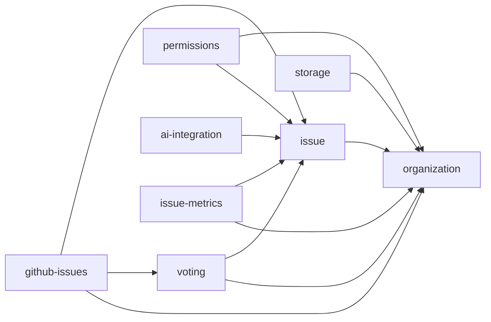

# IssueNumber.one Features

Top-level features of IssueNumber.one — a communication tool that helps teams identify and address their top priority issues through a continuous focused feedback and improvements process.

## Index

| Feature | Status | Description |
|---------|--------|-------------|
| [Public questions and primary issues](public-questions/README.md) | Conceptual | IssueNumber.one helps a person state their most important issue in a real scope, understand the priorities of other participants, and invite people whose views matter to them. Issues persist as objects; this is not an arbitrary survey builder. The public acquisition surface leads naturally to Sneat.app relationships and Sneat.work audience-specific feedback, without claiming those products already provide private question workflows. |
| [Issue](issue/README.md) | Conceptual | An issue is the atomic unit of IssueNumber.one — a raised priority item that a team, company, or public topic must identify and address. A person may keep multiple open issues, but may nominate at most one personal #1 issue within each organization and separately within each public topic. Only those context-specific nominations enter collective voting, so scarcity applies to attention rather than to recording problems. |
| [Voting](voting/README.md) | Conceptual | Voting is the positive-support mechanism by which eligible members decide which issue is #1 at each scope. The MVP has no downvotes or opposing votes. A personal #1 automatically receives one free creator star. In addition, every person has one support-vote unit by default, configurable from one to seven. In the MVP, every eligible member of an organization receives the same configured budget, shared across all levels of that organization. Every budgeted vote is assigned directly to an issue, not to a team, department, company, or other hierarchy level. Members may assign several budgeted units to one issue, support their own nominated issue, and reassign their votes at any time. |
| [Organization](organization/README.md) | Conceptual | IssueNumber.one models a company as a root team with nested department, project, and team nodes. Each node has its own candidate set and top-N ranking, and automatically contributes only its current #1 issue to its parent. Votes remain assigned to the issue as its visibility changes. Leaders may drill from the root through every node to the originating person and issue. Public topics live outside this hierarchy. |
| [Permissions](permissions/README.md) | Conceptual | Defines the access matrix for every action in IssueNumber.one: who can raise issues, see personal and ranked views, vote at each organizational scope, confirm closure, moderate content, administer organization-wide settings, and create or archive teams and topics. Most permissions derive from membership and the issue's place in the #1 bubble-up path. A constrained organization-administrator role controls settings such as the shared vote budget but receives no special power to block promotion, close an inconvenient issue, or cast extra votes. |
| [Storage](storage/README.md) | Conceptual | Teams and orgs choose where their IssueNumber.one data is stored: the IssueNumber.one cloud (Firestore-backed by default) or a GitHub repository via [inGitDB](https://inGitDB.com). Public topics always use a public GitHub repository, proxied by an API layer for performance. |
| [AI Integration](ai-integration/README.md) | Conceptual | An optional feature a team or org can enable to have an AI model analyze the current set of issues and produce an executive summary — what's trending, where focus is converging, and what risks are emerging. Offered both as a free-prompt mode (bring-your-own-model) and as a hosted SaaS with optimized setup, privacy guarantees, and zero maintenance. |
| [Issue performance metrics](issue-metrics/README.md) | Draft | Shows team- and department-level measures of issue closure speed and how often originating issues rise through the priority hierarchy. |
| [GitHub Issues integration](github-issues/README.md) | Draft | Lets GitHub Issues participate in IssueNumber.one nomination, scarce voting, and bubble-up without replacing GitHub as the issue system of record. |

## Feature Summaries

### issue

The core entity. A person may keep multiple open issues, but may nominate at most one personal #1 issue within each organization and separately within each public topic. Each nomination automatically receives one free creator star and is the only one of that person's issues entering collective voting in that context. Issues may be authored or anonymous, remain visibly open and ageing when they lose rank, and have a clear creator-controlled closure lifecycle.

### voting

Votes are scarce and positive-only in the MVP; there are no downvotes. Each eligible person receives one support vote by default, configurable from one to seven, with the same configured budget for every eligible member of an organization and shared across all organizational levels. This budget is additional to the free creator star on their personal #1. Budgeted votes are assigned directly to issues, may be concentrated on one issue including the voter's own, and may be reallocated at any time. Every issue has one score wherever it appears, and the older unresolved issue wins an equal-score tie. Scope-level candidate sets determine which single #1 issue automatically becomes eligible at the parent scope.

### organization

Everything in IssueNumber.one is scoped to a nested team node. A company is the root node; departments, projects, and teams are nested nodes beneath it. Every node has its own ranking, exposes its top N locally, and contributes only its current #1 issue to its parent. Leaders can drill from company to department, project, team, person, and originating issue.

### permissions

Defines who can raise, see, vote, close, moderate, administer settings, and create across teams, companies, topics, and issues. Members see their own issue list plus the top N issues at their department and company scopes. Any department member may vote in the department ranking. Only organization administrators may change the shared vote budget, but administrator status cannot block automatic promotion, add voting power, or close an active issue merely to remove it from view.

### storage

Teams and orgs choose where their data lives: the IssueNumber.one cloud (default, Firestore-backed) or a GitHub repository (public or private) via [inGitDB](https://inGitDB.com). Public topics are always stored in a public GitHub repository proxied by an API layer.

### ai-integration

An optional feature a team/org can enable to have AI analyze current issues and provide an executive summary. Includes both a free-prompt mode and a hosted SaaS offering optimized for easy setup, privacy (including anonymity preservation), and zero maintenance.

### issue-metrics

Shows team- and department-level measures of how quickly issues close and how many originating issues reach the defined top-priority milestone. Reach is displayed as both an absolute count and a percentage with its denominator and reporting context.

### github-issues

Links an existing GitHub Issue into an IssueNumber.one product scope while
leaving GitHub available as the work item's system of record. IssueNumber.one
adds personal nomination, scarce positive support, ranking, and organizational
bubble-up; GitHub reactions and backlog activity do not silently become votes.

### public-questions

IssueNumber.one helps a person state their most important issue in a real scope, understand the priorities of other participants, and invite people whose views matter to them. Issues persist as objects; this is not an arbitrary survey builder. The public acquisition surface leads naturally to Sneat.app relationships and Sneat.work audience-specific feedback, without claiming those products already provide private question workflows.

## Feature Dependency Graph

```mermaid
graph LR
    ORG[organization]
    ISS[issue]
    VOT[voting]
    PERM[permissions]
    STOR[storage]
    AI[ai-integration]
    MET[issue-metrics]
    GHI[github-issues]

    ISS --> ORG
    VOT --> ISS
    VOT --> ORG
    PERM --> ORG
    PERM --> ISS
    STOR --> ORG
    AI --> ISS
    MET --> ISS
    MET --> ORG
    GHI --> ISS
    GHI --> VOT
    GHI --> ORG
```

## Open Questions

- Should `assignee` and `deadline` (surfaced on the landing page) be part of `issue` core or a separate `issue/assignment` sub-feature?
- Should progress tracking (the progress bar surfaced on the landing page) be its own sub-feature of `issue`?
- Does `permissions` belong at the top level or nested under `organization`?
